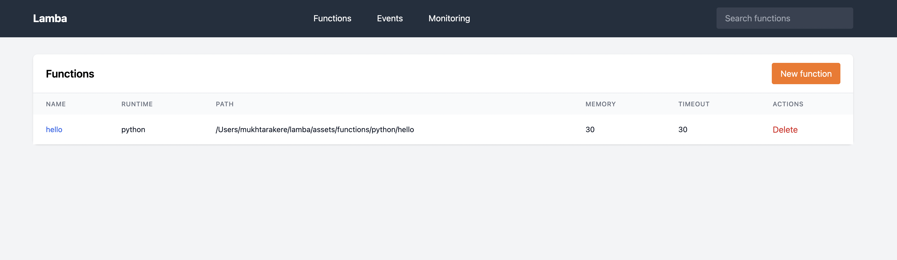

## Lamba(A self-hosted [AWS Lambda](https://aws.amazon.com/lambda/) clone)



#### WIP

Lamba is a self-hosted AWS Lambda clone written in Go. It is designed to be compatible with the AWS Lambda API, but it is not a drop-in replacement

This only supports Python and Node.js runtime for now

### Features

- [x] Adding a function
- [x] Invoking a function
- [x] List functions
- [x] List events

### Prerequisites

- Docker: 
  - You need to have Docker installed on your machine to run this. You can download it from [here](https://docs.docker.com/get-docker/)


### Installation


#### From Binary

You can download the pre-built binaries for different platforms from the [Releases](https://github.com/sirrobot01/lamba/releases/) page. Extract them using tar, move it to your $PATH and you are ready to go.

```bash

#### From Source

```bash
go install -u github.com/sirrobot01/lamba
```

### Usage

- Start the server

```bash
lamba
```


- Prepare your function code and then zip it

### Roadmap

- [ ] Add support for more runtimes(Go, Rust, etc.)
- [ ] Add support for more event sources
- [ ] Add support for more triggers